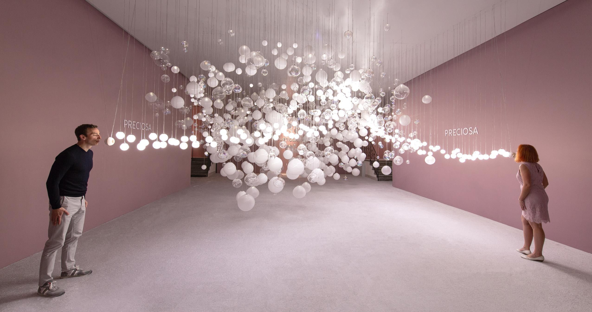
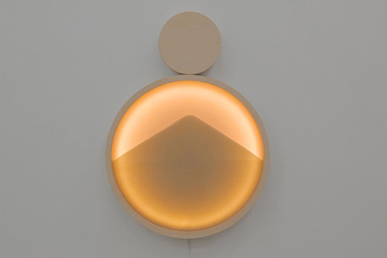
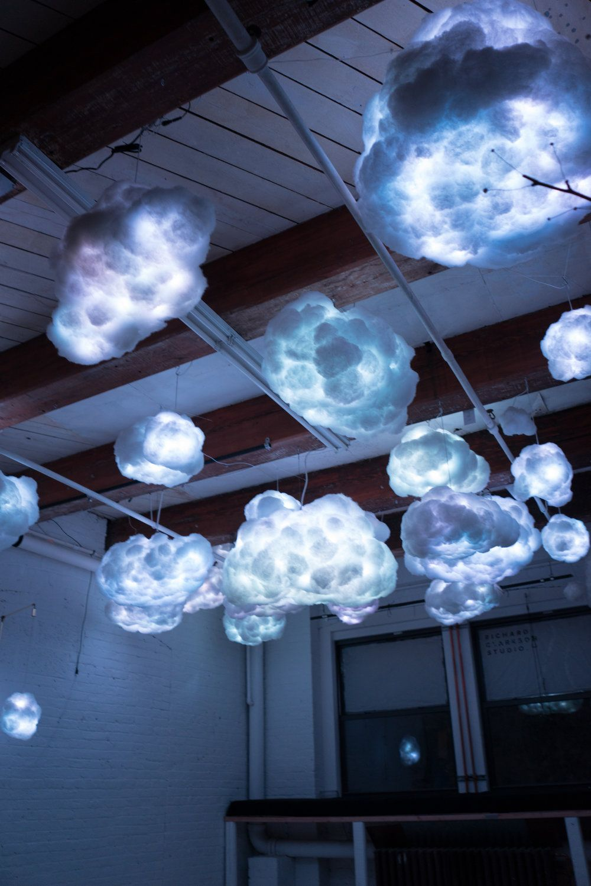
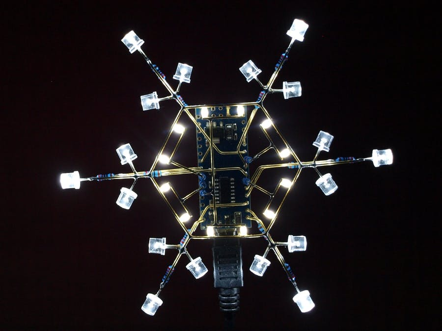
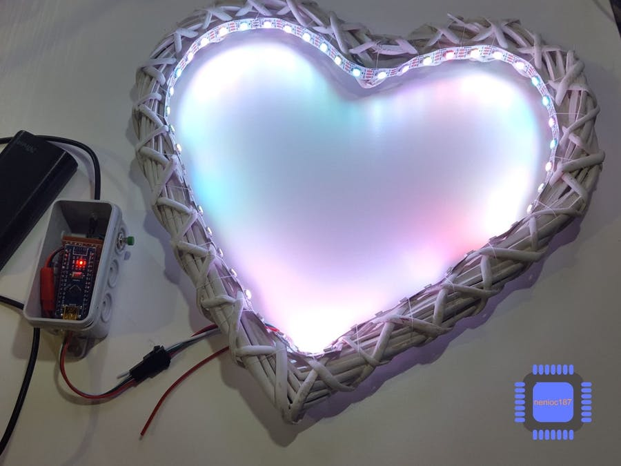
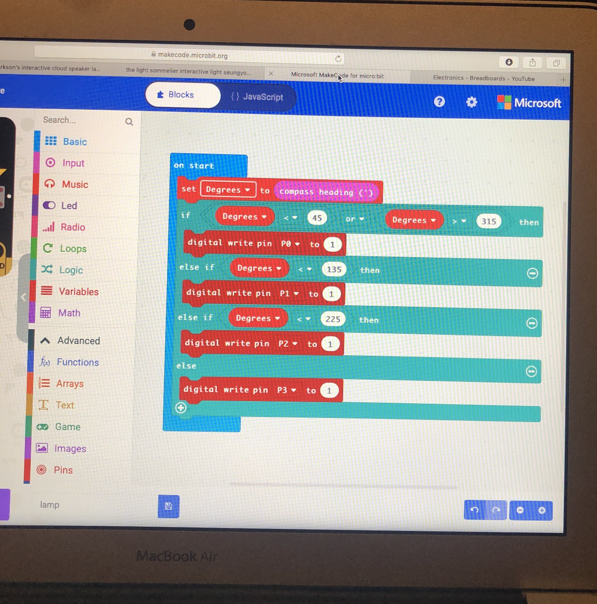

# 1701QCA Making Interaction - Assessment 2 workbook

When you have completed the template, submit the link to the GitHub Pages site for this repository as a link in Learning@Griffith. The link should be something like [https://qcainteractivemedia.github.io/1701QCA-Assessment2/](https://qcainteractivemedia.github.io/1701QCA-Assessment2/) where `qcainteractivemedia` is replaced with your GitHub username and `1701QCA-Assessment2` is replaced with whatever you called the repository this template is contained in when you set it up.

 ## Project working title ##
 *Insert a name for the project as you conceive of it at the moment.*
 ## Night light ##

 ## Related projects ##
 *Find about 6 related projects to the project you choose. A project might be related through  function, technology, materials, fabrication, concept, or code. Don't forget to place an image of the related project in the appropriate folder and insert the filename in the appropriate places below. Copy the markdown block of code below for each project you are showing.*

 ### Related project 1 ###
 *Insert name of project*
 Breath of light 

 https://www.youtube.com/watch?v=CfVTQ6jrqg0

This project is related to mine because it involves lights and the aesthetic is beautiful which inspires me to create a final project that is also beautiful to look at. The lights turn on depending on the sensor which is kind of similar to mine where the lights depend on a particular variable.

 ### Related project 2 ###
 Interactive lamp

 http://www.designgallerist.com/blog/interactive-lamp-contemporary-design-kolo/

This project is related to mine because it is all about light and making a lamp more than just a basic on and off switch. This is similar to my project as I have the same idea in mind, making a lamp interactive and pretty. Although technically it isn't related to my project with very different techniques and materials used. It's still dependent on touch and requires touch for it to change light and make movement, my project is also dependent on touch.

 ### Related project 3 ###
 Interactive cloud 

 https://www.youtube.com/watch?v=UQSZQZIuIk4

 

 This project is related to mine because at the beginning this was one of my biggest inspirations and i wanted to create something similar. I couldn't copy a project that already exsits though so it just gave me an idea of what my design intent will be and the area that I'm interested in. I was going to include sound in my final project too but it is way out of my depth to create. It is a much larger project than what I'm creating but it still involves LED light which relates to my project.

 ### Related project 4 ###
 Slap It: Cheeky Interactive Lights

 https://design-milk.com/slap-cheeky-interactive-lights-joseph-begley/

 

 This project is related to mine because again it includes LED lights and also requires touch to set off. The different coloured LED's is also related to mine as I would like to include different colours depending on touch or movement. I think this project is fun and looks enjoyable, I would like to include the same aspects in my final project. 

 ### Related project 5 ###
 Arduinoflake
 https://create.arduino.cc/projecthub/jiripraus/arduinoflake-139a82?ref=tag&ref_id=led&offset=16

 

 This project is related to mine because when it is touched in different spots a different reaction happens. So depending on the touch the LED's will make a different pattern or flash. This is similar to mine where the light has a different reaction depending on the variable. 

 ### Related project 6 ###
 The glowing heart

 *Insert URL to project*
 https://create.arduino.cc/projecthub/remnis/the-glowing-heart-e031c0?ref=tag&ref_id=led&offset=8

 

 This project is related to mine because *insert reasons here*.
 This project is related to mine because it could be used as a bed side table lamp. This is my whole design intent and this project would fit into one of my design concept as it is physically and interactively something that I would like my final project to include. Again it has different coloured LED's which my project will have as well.

 ## Other research ##

 ### Making compass ###
 https://makecode.microbit.org/projects/compass
 This page from Mircowas useful for my project as it help me wrap my head around the basics of compass coding which I have to include in my project. 

 https://www.youtube.com/watch?v=tzK1AKUiGy0
 I found this video useful in terms of the compass coding. The tutorial explains all the steps and makes it easy to follow.

 ### Connecting LED lights ###
 https://www.youtube.com/watch?v=yQ2-yVXFMeE
 I watched many videos similar to this one to help myself learn more about LED circut. All the videos that i watched are similar but some more than others relate to my project more. Although in my final project I will probably use crocodile clips instead of the breadboard but these videos still help me get an idea of the technical side. 

 https://www.youtube.com/watch?v=OlTcVX4W0yk
 Another connecting LED to breadboard youtube video. 

 ## Conceptual progress ##

 ### Design intent ###
 The design intent for this project is a night light sutible for a side table, the light will be interactive with a nice aesthetic look.

 ### Design concept 1 ###
 Chair carousel 
I have 3 different concepts that all have a similar function. The first concept has a chair carousel look, it would small enough for a side table and the chairs would be replaced with 5 fairy lights. When you press the button at the base it will turn on the fairy lights and it will start rotating which makes the fairy lights attached fly out and around clockwise.

 Materials:
 - Mirco continous rotation servo 
 - Mircro bit 
 - 3x M/F jumper wires 
 - Fairy lights
 - String 
 - Wood/ wood pole

 

 

### Design concept 2 ###
Crater lamp
The crater lamp is also suitable for a side table that reflects a beautiful patterned light around the dark room. It allows preferred amount of light out through the holes. The lamp would be a acrylic cube with about 12 different sized holes arounf it, it would be a soild colour not allowing light out unless a cork block was removed from one of the holes.

 Materials:
 - Acrylic 
 - Cork blocks 
 - LED 
 - Mircobit 

 

 ### Final design concept ###
 
Colourful night light 
My final design concept is a interactive night light that is a cube shape. It has four different LED colours that is connected to four different sides of the cube, depending on which side is facing up either green, yellow, orange or red will appear. It is dependent on a compass inside of the cube, each north, east, south and west have a different colour. This means the object will be a certain degree to make the colours change. The cube will be transparent enough for the LED to shine through but it will also hide the materials and tech inside of the cube. The light will be a size that can comfortably sit in one hand and can sit on the side table.

 Materials:
 - LED lights (Green, yellow, red, orange)
 - Mircobit 
 - Crocodile clips 
 - Acrylic or material for the cube
 - Tape

 ### Interaction flowchart ###

 

 ## Physical experimentation documentation ##

 

 This is a rough sketch of the night light. 

 

 This is a screenshot of my coding experimentation. Although I haven't got as far as I wanted with the technical side, I played around with coding and the bread board just to experiment what does and doesn't work. I haven't yet figured out the correct coding but with more research and materials for testing I will soon figure it out. This is my compass coding I've been working with and trying to figure out how to make the direction correspond with the LED. It still needs work and more test but it is a good starting point.

 

 

 This is the bread board and experimenting with one LED light first. I had to look back on pervious activities to get an idea of how it comes together. Again the technical side needs improvement and more development as I haven't yet figured it out completely.

 ## Design process discussion ##

 In relation to the Double Diamond design through the planning phase I spent alot of time finding secondary research and brainstorming to bring together more ideas and possiblities for my project. The time spent of research was helpful to then focus on the define and development phase of the design process. Planning my materials to use was easier from my related projects I found, it gave me an idea of what works and what doesn't before testing it myself. The technical side of my project had a lot of trial and error, first I tried to set up the bread board with all the LED's which didn't work but then found it easier handing one LED at a time to then gradually work with all four LED's. It was the same situtaion with the coding, I keep trying to figure out the coding using all the directions and LED but I think I need to focus on one LED and working my way up. When following tutorials and videos it was easier to put the coding and bread board together and then adjusting it to suit my project  
 
 ## Next steps ##
 My next step in finalising my project is to focus on the technical side of it and pulling my materials together. I have a list of materials that I think is required for my project so I need to gather them and test what works and doesn't. I also need to find more tutorials on the mircobit to push me along further in the development as I still can't figure out how to make the compass and LED's correspond. I have some of the coding and technical thnigs started so this part shouldn't take up much more time. After I have mastered this I will have to focus on the physical apperance of my project as this part is a big deal and I would like to creat something with a great aesthetic.  
